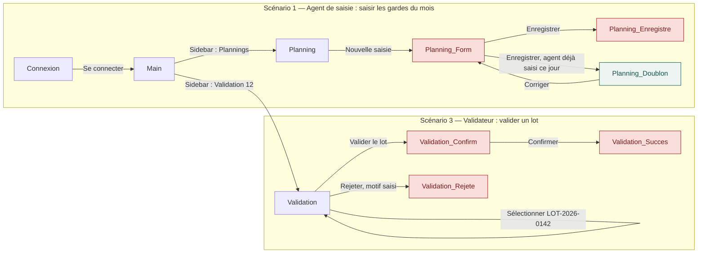

# Carte des parcours — format

La carte est un diagramme Mermaid `flowchart`. Règle unique : **un nœud = un écran ou un état visible ; une flèche = une action de l'utilisateur, étiquetée par le libellé exact de l'élément actionné.** Les états (confirmation, erreur, vide, chargement) sont des nœuds à part entière, avec un style distinct, pour qu'on voie d'un coup d'œil ceux qui n'ont pas encore d'écran.

Conventions :
- Identifiant du nœud = nom du fichier de capture (`Planning`, `Validation`…) ; les états prennent un suffixe (`Validation_Confirm`, `Personnel_ImportErreur`).
- Un nœud dont la capture n'existe pas encore est marqué `:::absent` — c'est un constat `ECRAN-ABSENT` ou `RETOUR-ABSENT` en attente.
- Une flèche dont on ne sait pas écrire la destination reçoit `-.->` (pointillé) vers un nœud `??` : l'écrire quand même, c'est le but de l'exercice.
- Regrouper par scénario avec `subgraph` quand il y a plus d'un parcours.

## Exemple (extrait GESTINDEM)

Lecture : trois nœuds rouges dans le scénario 1 → le formulaire de saisie, son résultat et le retour d'enregistrement ne sont pas dessinés. Le nœud vert `Planning_Doublon` existe (bandeau de cohérence sur la capture Planning).

## Ce que la carte apporte avant même le walkthrough

- Elle force à nommer **la destination de chaque action** : c'est là que les états manquants apparaissent.
- Elle rend visible les **retours arrière** (existe-t-il une flèche pour annuler ?) et les **culs-de-sac** (nœud sans flèche sortante).
- Elle sert de plan de test pour le futur prototype cliquable et pour les tests d'intégration : chaque flèche est un cas.
