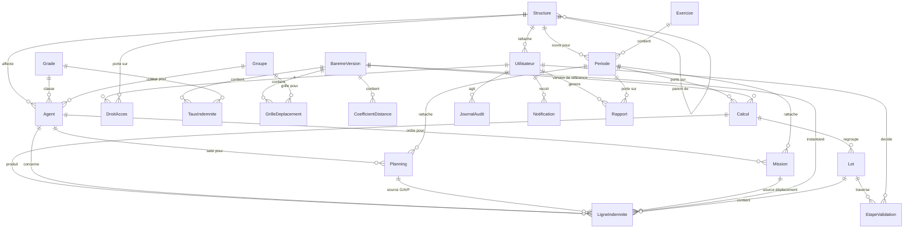

# ADR-003 : Modèle de données et endpoints REST v1

**Status:** Accepted
**Date:** 2026-09-03
**Deciders:** Abdellatif (chef de projet / développeur)
**Related:** ADR-001 (prototype de référence), ADR-002 (couches et logique de calcul)

## Context

Le cahier des charges (§5) donne **9 entités indicatives** et précise qu'elles « pourront être affinées lors de la conception détaillée ». Trois points structurants restaient indéterminés, et chacun conditionne un critère de recette (§9) :

1. **Historisation des barèmes** — M4 exige une « date d'entrée en vigueur » sans dire si l'on version le barème entier ou chaque ligne.
2. **Définition d'un lot** — M9 fait du « lot » l'objet du workflow sans le définir ; les maquettes montrent `LOT-2026-0142 · Urgences · Garde · août 2026 · 12 agents · 18 450 DH`.
3. **Barème « en vigueur à la date concernée »** — M6 l'exige et §9 le vérifie ; rien ne dit si le montant est recalculé ou conservé.

Ces trois décisions sont prises ici, puis le modèle et les endpoints en découlent. Le périmètre est celui d'ADR-002 : tout le métier dans l'API, `Contracts` ne portant que des DTO, API versionnée et réutilisable par un futur client mobile.

## Decision

### D-3.1 Barèmes : version complète datée

Un barème est une **version** (`v1`, `v2`, `v3`) portant une date d'effet et contenant l'intégralité de ses lignes : taux par grade et par type, grille de déplacement par groupe, coefficients de distance. Calculer au 12/08/2026 revient à sélectionner la version dont la plage `[DateEffet, DateFin[` contient cette date. Une revalorisation crée une **nouvelle version** (l'ancienne est archivée, jamais modifiée).

### D-3.2 Lot = structure(service) × type d'indemnité × période

Un lot regroupe les lignes d'indemnité d'un service, pour un type, sur une période, issues d'un calcul. C'est l'unité que le validateur traite et peut rejeter sans bloquer les autres services ou types. Numérotation `LOT-{année}-{séquence}`.

### D-3.3 Instantané du barème dans chaque ligne d'indemnité

Chaque `LigneIndemnite` conserve **le taux appliqué, la version de barème, le coefficient et le plafond** utilisés au moment du calcul. Un montant reste explicable des années plus tard ; un recalcul produit un **nouveau `Calcul`** avec son propre instantané, l'ancien passant en `Obsolete` — les deux restent comparables. Les données financières ne sont jamais modifiées en place.

### Modèle de données

**Attributs clés et invariants** (le reste est dérivable) :

| Entité | Attributs notables | Invariants / contraintes |
|---|---|---|
| `Structure` | Code, Libelle, Type (DirectionRegionale, Delegation, Hopital, CentreSante, Service), StructureParenteId, Province | Code unique ; arbre sans cycle ; un `Service` a forcément un parent |
| `Agent` | Matricule, Nom, GradeId, GroupeId, StructureId, DateAffectation, Actif | Matricule unique ; `GroupeId` obligatoire (il détermine les taux de déplacement) |
| `Utilisateur` | Identifiant, MotDePasseHash, Profil (Administrateur, AgentSaisie, Validateur, Consultation), StructureId, DerniereConnexion, DateExpirationMotDePasse | Identifiant unique ; hachage **PBKDF2/BCrypt**, jamais de mot de passe en clair ni réversible |
| `DroitAcces` | UtilisateurId, Module (enum des 12 modules), StructureId, Autorise | Matrice module × structure de l'écran `UtilisateurFiche` ; l'absence de ligne = hors périmètre |
| `Periode` | ExerciceId, StructureId, Type (Mois, Trimestre, Annee), DateDebut, DateFin, Etat (Ouverte, Cloturee) | Pas de chevauchement pour un même couple (structure, type) ; une période close refuse toute saisie |
| `BaremeVersion` | Numero, DateEffet, DateFin (null = en vigueur), Etat (Brouillon, EnVigueur, Archivee), CreeParId, Commentaire | Plages disjointes et contiguës ; une version `Archivee` est **immuable** |
| `TauxIndemnite` | BaremeVersionId, GradeId, Type (Garde, Astreinte, Permanence), Montant, UniteDuree | Unicité (version, grade, type) ; `UniteDuree` paramétrable (question client n°7) |
| `GrilleDeplacement` | BaremeVersionId, GroupeId, IndemniteJournaliere, PlafondParMission | Unicité (version, groupe) |
| `CoefficientDistance` | BaremeVersionId, DistanceMinKm, DistanceMaxKm (null = au-delà), Coefficient | Tranches disjointes couvrant [0, ∞[ |
| `Planning` | AgentId, Date, Type, Duree, UniteDuree, ServiceId, PeriodeId, SaisiParId, DateSaisie | **Unicité (AgentId, Date, Type)** → c'est la détection de doublon ; refus si la période est close |
| `Mission` | Numero, AgentId, StructureId, PeriodeId, Destination, DateDepart, DateRetour, DureeJours, DistanceKm, Motif, Etat (Brouillon, EnCours, AClôturer, Cloturee, Annulee) | Numéro unique ; DateRetour ≥ DateDepart ; DistanceKm > 0 ; seule une mission `Cloturee` entre dans un calcul |
| `Calcul` | PeriodeId, StructureId, DateExecution, LanceParId, BaremeVersionId, Etat (EnCours, Termine, Obsolete), NbAgents, MontantTotal | Un seul calcul `Termine` courant par (période, structure) ; les précédents passent `Obsolete` |
| `LigneIndemnite` | CalculId, AgentId, Type, Quantite, **TauxApplique**, **BaremeVersionId**, **CoefficientApplique**, **PlafondApplique**, MontantBrut, MontantFinal, PlanningIds / MissionId, LotId | Instantané en gras : jamais recalculé ni écrasé ; `MontantFinal = min(MontantBrut, PlafondApplique)` pour un déplacement |
| `Lot` | Numero, StructureId, Type, PeriodeId, CalculId, NbAgents, Montant, Etat (Saisie, Verification, Validation, PretPourPaiement, Rejete), MotifRejet | Unicité (structure, type, période, calcul) ; un lot `PretPourPaiement` est immuable |
| `EtapeValidation` | LotId, Etape, Decision (Valide, Rejete), UtilisateurId, DateHeure, Motif, CleIdempotence | Motif **obligatoire** si `Rejete` ; horodatage serveur ; append-only |
| `JournalAudit` | UtilisateurId, Action, Entite, EntiteId, DateHeure, Avant, Apres, AdresseIp | **Append-only** : aucune mise à jour ni suppression, y compris par un administrateur |
| `Notification`, `Rapport`, `Sauvegarde` | voir écrans `Notifications`, `Etats`, `Administration` | Rapport archivé = fichier immuable + métadonnées |

### Formules de calcul (une seule implémentation, `Gestindem.Application`)

- **Garde / astreinte / permanence** : `Montant = Quantité × TauxIndemnite(grade, type, barème en vigueur à la date du planning)`, agrégé par agent, type et période.
- **Déplacement** : `MontantBrut = DuréeJours × IndemniteJournaliere(groupe) × Coefficient(distance)`, puis `MontantFinal = min(MontantBrut, PlafondParMission(groupe))` — cas prouvé par la planche `MissionPlafonnee` (4 × 250 × 1,5 = 1 500 → 1 200 DH).
- **Barème retenu** : celui en vigueur **à la date du planning ou du départ de mission**, jamais le barème courant.

### Endpoints REST v1 (dérivés écran par écran des 29 planches)

Conventions communes : `/api/v1`, JWT `Authorization: Bearer`, listes paginées `?page=&taille=&tri=&…filtres`, réponses `{ donnees, page, taille, total }`, erreurs `{ code, message, details[] }` avec codes stables, `Idempotency-Key` obligatoire sur les actions marquées ⚿.

| Module | Endpoints |
|---|---|
| **Auth / moi** (M1) | `POST /auth/connexion` · `POST /auth/rafraichir` · `POST /auth/deconnexion` · `GET /moi` (profil + droits + périmètre) · `PUT /moi/mot-de-passe` |
| **Structures** (M2) | `GET /structures?type=&parent=` (arbre) · `GET|POST|PUT /structures/{id}` · `GET /structures/{id}/periodes` · `POST /periodes` (ouvrir) · `POST /periodes/{id}/cloture` ⚿ |
| **Personnel** (M3) | `GET /agents?grade=&groupe=&structure=&q=` · `GET|POST|PUT /agents/{id}` · `GET /agents/{id}/recapitulatif?periode=` · `POST /agents/import-excel` (multipart → rapport ligne à ligne) · `GET /grades` · `GET /groupes` |
| **Barèmes** (M4) | `GET /baremes/versions` · `GET /baremes/versions/{id}` · **`GET /baremes/en-vigueur?date=`** · `POST /baremes/versions` · `PUT /baremes/versions/{id}` (brouillon seul) · `POST /baremes/versions/{id}/mise-en-vigueur` ⚿ |
| **Plannings** (M5) | `GET /plannings/mois?service=&mois=` (vue calendrier) · `GET /plannings?…` · **`POST /plannings/controle`** (doublon + cohérence, sans écrire) · `POST|PUT|DELETE /plannings/{id}` · `GET /plannings/anomalies?periode=` · `POST /plannings/import-excel` · `GET /plannings/avancement?service=&periode=` (ligne d'état de l'écran) |
| **Missions** (M7) | `GET /missions?etat=&periode=` · `GET /missions/{id}` · `POST|PUT /missions/{id}` · **`POST /deplacements/simulation`** (calcul prévisionnel) · `POST /missions/{id}/cloture` ⚿ · `GET /missions/historique?agent=&du=&au=` |
| **Calcul** (M6/M8) | `POST /calculs` ⚿ (période + structure) · `GET /calculs?periode=&structure=` · `GET /calculs/{id}/lignes?agent=&type=` · `GET /calculs/{id}/lignes/{ligneId}` (détail complet du calcul) · `POST /calculs/{id}/recalcul-agent/{agentId}` ⚿ · `GET /calculs/{id}/obsolescences` (agents « à recalculer ») |
| **Validation** (M9) | `GET /lots?etat=&periode=&structure=&tri=delai` · `GET /lots/{id}` · `GET /lots/{id}/lignes` · `POST /lots/{id}/verification` ⚿ · `POST /lots/{id}/validation` ⚿ · `POST /lots/{id}/rejet` ⚿ (motif requis) · `POST /lots/{id}/annulation` ⚿ (fenêtre de 5 min) · `GET /lots/synthese?periode=` (les 4 étapes et leurs compteurs) |
| **États** (M10) | `POST /rapports` → `202` + id · `GET /rapports?type=&exercice=` (archive) · `GET /rapports/{id}` · `GET /rapports/{id}/fichier` · `POST /rapports/{id}/regeneration` ⚿ |
| **Statistiques** (M11) | `GET /statistiques/tableau-de-bord?structure=&periode=` · `GET /statistiques/evolution?du=&au=&comparer=` · `GET /statistiques/repartition?periode=&par=type\|service\|structure` · `GET /statistiques/comparaison-structures?periode=` |
| **Administration** (M1/M12) | `GET /utilisateurs?profil=&structure=` · `GET|POST|PUT /utilisateurs/{id}` · `PUT /utilisateurs/{id}/droits` (matrice) · `POST /utilisateurs/{id}/reinitialisation-mot-de-passe` ⚿ · `GET /journal-audit?utilisateur=&entite=&du=&au=` · `GET /sauvegardes` · `POST /sauvegardes/{id}/restauration` ⚿ (confirmation forte) · `GET /notifications?lues=` · `POST /notifications/{id}/lecture` · `POST /notifications/tout-lu` |

**Codes d'erreur métier** (stables, indépendants de la langue) : `PLANNING_DOUBLON`, `PERIODE_CLOTUREE`, `BAREME_ABSENT_A_DATE`, `AGENT_SANS_GROUPE`, `MISSION_DATES_INVALIDES`, `MISSION_NON_CLOTUREE`, `LOT_DEJA_VALIDE`, `LOT_MOTIF_REQUIS`, `LOT_HORS_PERIMETRE`, `DROIT_INSUFFISANT`, `IMPORT_LIGNE_INVALIDE`, `CALCUL_DEJA_EN_COURS`, `ANNULATION_EXPIREE`.

## Options Considered

### D-3.1 Historisation des barèmes
| Option | Complexité | Auditabilité | Retenue |
|---|---|---|---|
| **Version complète datée** | Faible | Élevée : « le barème au 12/08 » est une ligne de base | **Oui** |
| Lignes datées individuellement | Moyenne | Faible : reconstitution nécessaire, l'historique par version disparaît | Non |

**Pros de la retenue :** correspond à l'écran validé (v1/v2/v3 avec plages) ; une version archivée immuable est une preuve ; requête de calcul triviale.
**Cons :** revaloriser un seul grade impose une nouvelle version complète — acceptable, une revalorisation est un acte réglementaire daté.

### D-3.2 Définition du lot
| Option | Granularité de rejet | Volume mensuel | Retenue |
|---|---|---|---|
| **Service × type × période** | Fine | ~12 lots / structure / mois | **Oui** |
| Structure × période | Grossière (tout ou rien) | ~1 lot | Non |
| Agent × période | Excessive | ~248 lots | Non |

### D-3.3 Barème appliqué
| Option | Traçabilité | Risque | Retenue |
|---|---|---|---|
| **Instantané stocké** | Totale | Données un peu redondantes (assumé) | **Oui** |
| Recalcul à la lecture | Nulle sur l'historique | Un montant payé peut changer sans trace | Non |

## Trade-off Analysis

Les trois décisions convergent vers le même principe : **en finance publique, la traçabilité prime sur la normalisation**. Stocker le taux appliqué duplique une information déjà présente dans le barème — c'est une redondance *voulue*, qui transforme chaque ligne d'indemnité en pièce justificative autonome. Le coût est un peu d'espace disque et la discipline de ne jamais modifier une ligne existante ; le bénéfice est qu'aucune évolution de barème ne peut réécrire le passé, exactement ce que §9 vérifiera.

Le lot au niveau service × type coûte plus d'actions au validateur qu'un lot unique, mais c'est le prix d'un rejet ciblé — et le walkthrough a montré que le circuit reste fluide (filtres, lot suivant proposé, compteurs).

## Consequences

- **Plus facile** : répondre à « pourquoi ce montant ? » (une ligne suffit) ; recette du critère « barèmes paramétrés appliqués » ; rejeu d'un calcul sans toucher l'existant ; jeu de démonstration reproductible.
- **Plus difficile** : discipline d'immuabilité à respecter dans le code (pas de `UPDATE` sur `LigneIndemnite`, `EtapeValidation`, `JournalAudit`, `BaremeVersion` archivée) — à vérifier en revue de code ; deux calculs d'une même période coexistent, l'interface doit toujours indiquer lequel est courant (déjà prévu : badge « À recalculer »).
- **À revisiter** : le statut « Vérification » suppose une décision client (question n°4) ; l'unité de durée des plannings reste paramétrable jusqu'à confirmation (question n°7) ; la règle « recalcul vs lot déjà validé » (question n°1) déterminera si l'on ajoute une entité `Regularisation`.

## Action Items
1. [ ] ADR-004 — stratégie de tests : cas « golden » des deux moteurs de calcul (dont le cas plafonné), tests d'intégration API, jeu de démonstration
2. [ ] Créer la solution .NET (7 projets d'ADR-002) et les entités `Domain` ci-dessus
3. [ ] Première migration EF Core avec les contraintes d'unicité (`Agent.Matricule`, `Planning(Agent,Date,Type)`, `Lot(Structure,Type,Periode,Calcul)`) et les index de lecture
4. [ ] Implémenter `IBaremeEnVigueurService` (sélection par date) puis les deux moteurs de calcul — **tests d'abord**
5. [ ] Générer OpenAPI et vérifier que `Desktop` ne référence que `Contracts`
