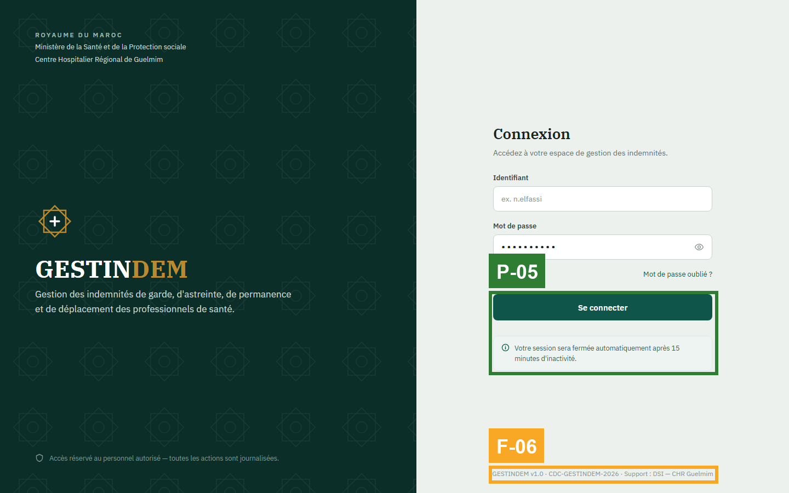
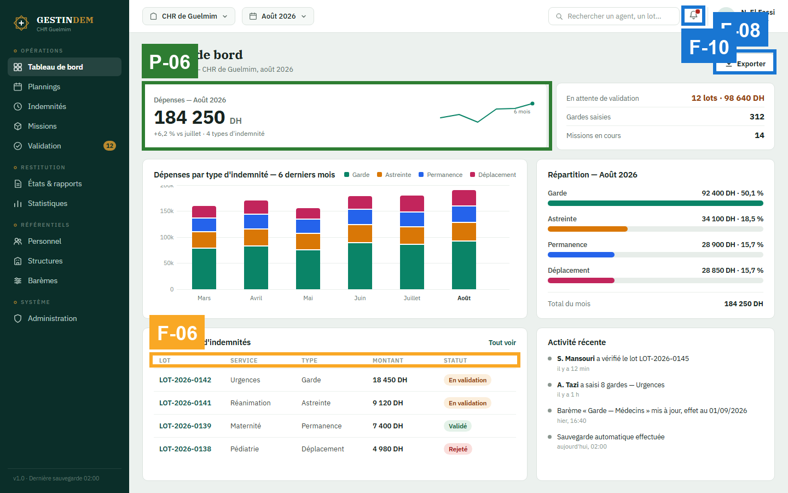
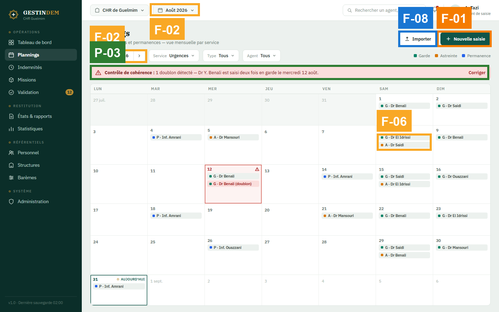
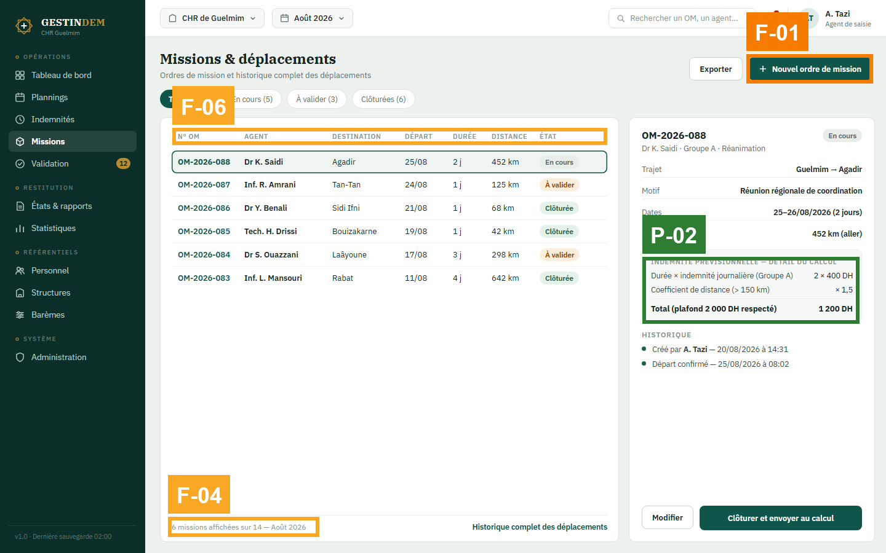
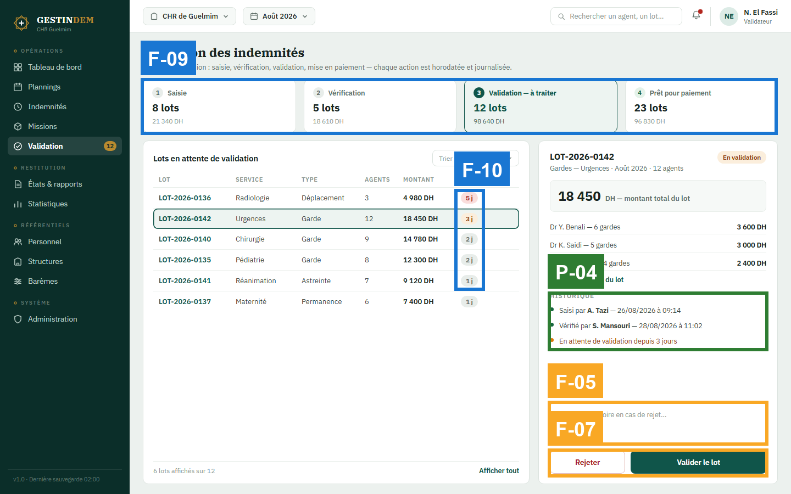
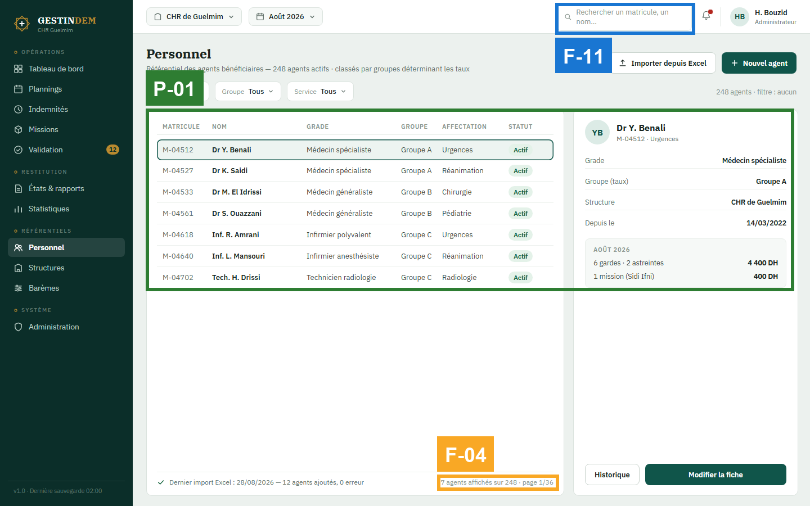
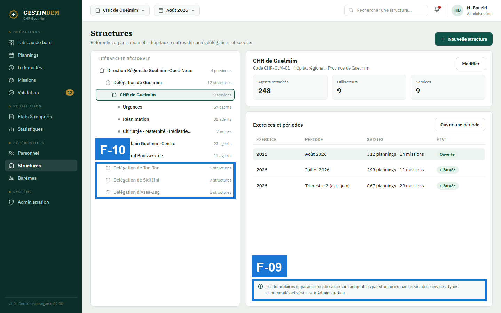
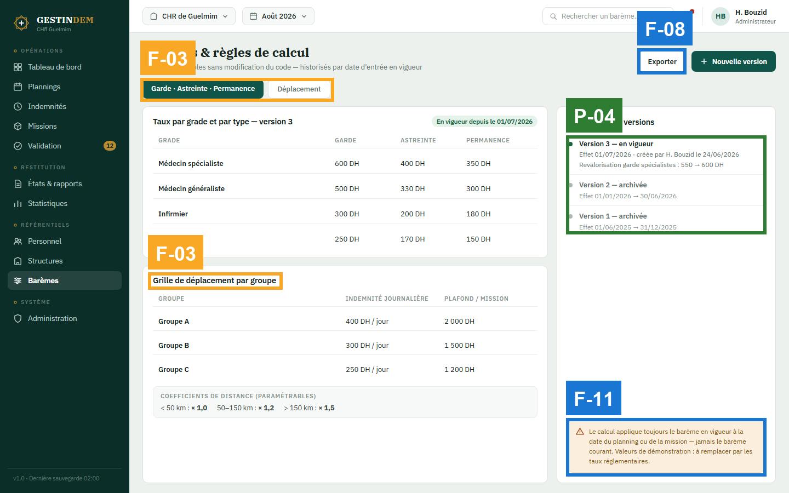

# Audit UX — GESTINDEM : parcours saisie → mission → validation → tableau de bord

## Résumé exécutif

Les maquettes forment un système cohérent et lisible : navigation identique sur tous les écrans, un seul motif d'interface (liste + panneau de détail) répété partout, libellés d'action explicites, statuts toujours accompagnés d'un texte, calculs montrés en détail. Un utilisateur récurrent comprend où il est et quoi faire sans explication. Aucun constat critique.

Le risque principal n'est pas dans ce qui est dessiné mais dans ce qui ne l'est pas encore : **les formulaires de saisie** (garde/astreinte/permanence, ordre de mission) et **les états vides, d'erreur et de confirmation** sont absents du parcours, alors qu'ils portent l'objectif même de l'application et seront au cœur de la démonstration exigée par l'avis d'achat. Trois corrections prioritaires : (1) dessiner les formulaires de saisie et les états de retour ; (2) supprimer l'ambiguïté du double contrôle de période sur Plannings et celle des onglets sur Barèmes ; (3) relever la lisibilité des textes secondaires (contraste et tailles < 12 px), point d'accessibilité transversal.

## Périmètre et méthode

- **Objectif évalué** : un agent de saisie se connecte, saisit les gardes du mois, crée un ordre de mission ; un validateur valide un lot d'indemnités et consulte le tableau de bord.
- **Utilisateurs / plateforme** : mixtes, majoritairement récurrents (agents de saisie, validateurs, administrateurs) ; desktop Windows 1440×900 ; interface en français.
- **Écrans** :

| Étape | Fichier | Écran |
|---|---|---|
| 1 | `Connexion.png` | Connexion |
| 2 | `Main.png` | Tableau de bord |
| 3 | `Planning.png` | Plannings — vue mensuelle |
| 4 | `Missions.png` | Missions & déplacements |
| 5 | `Validation.png` | Validation des indemnités |
| 6 | `Personnel.png` | Personnel |
| 7 | `Structures.png` | Structures |
| 8 | `Baremes.png` | Barèmes & règles de calcul |
| réf. | `Identite.png` | Planche d'identité visuelle (cohérence seulement) |

- **Référentiels appliqués** : Nielsen, Shneiderman, Gerhardt-Powals, Bastien & Scapin, lois comportementales (Hick, Fitts, Miller, Jakob, Peak-End), Fogg, Cialdini, Gestalt, Norman, Tognazzini, WCAG 2.1 (sous-ensemble vérifiable sur image), heuristiques de contenu.
- **Non évaluable sur captures statiques** (à vérifier dans le prototype WPF) : visibilité du focus clavier, ordre de tabulation, sémantique lecteur d'écran (`AutomationProperties`), confirmation/annulation après « Valider le lot » et « Rejeter », comportement au survol des cellules du calendrier, latence et retours de chargement, animations.

## Vue d'ensemble des constats

| ID | Sév. | Écran(s) | Vérification | Constat | Heuristiques |
|---|---|---|---|---|---|
| F-01 | 3 | Planning, Missions | STATE-GAP | Les formulaires de saisie (garde/astreinte/permanence, ordre de mission) n'existent pas dans le parcours | Nielsen #1, #5 · Shneiderman #4 · B&S : Guidage |
| F-02 | 2 | Planning | PATTERN-DRIFT | Deux contrôles de période concurrents : « Août 2026 » dans la barre supérieure et le navigateur de mois du calendrier | Nielsen #4 · G-P #2 · Norman : mapping |
| F-03 | 2 | Baremes | CTA-AMBIGUITY | Les onglets « Garde · Astreinte · Permanence / Déplacement » suggèrent deux vues, mais la grille de déplacement est déjà affichée sous l'onglet actif | Nielsen #4 · Norman : modèle conceptuel · B&S : Signifiance des codes |
| F-04 | 2 | Missions, Personnel | DEAD-END | Listes tronquées (« 6 missions affichées sur 14 », « page 1/36 ») sans contrôle de pagination ni lien « Afficher tout » | Nielsen #1, #3 · Tog : navigation visible |
| F-05 | 2 | Validation | FORM-FRICTION | Champ « Motif » sans libellé (texte indicatif seul) ; l'obligation conditionnelle n'est signalée que dans le placeholder | WCAG 3.3.2 · Nielsen #5 · Content #6 |
| F-06 | 2 | Tous | CONTRAST-FAIL | Textes secondaires ≤ 11 px en gris (#8A968F sur blanc, #5F776E sur vert sombre) probablement sous 4,5:1 ; chips du calendrier à 10,5 px | WCAG 1.4.3 · Tog : lisibilité · B&S : Lisibilité |
| F-07 | 2 | Validation, Personnel, Planning (parcours) | STATE-GAP | Aucun état vide, d'erreur ou de succès n'est montré (mois sans planning, import Excel en erreur, retour après validation/rejet) | Nielsen #1, #9 · Peak-End · Content #6 |
| F-08 | 1 | Planning, Main, Baremes | Content | Actions sans objet : « Importer », « Exporter » — alors que Personnel dit « Importer depuis Excel » | Nielsen #2 · Content #3, #5 |
| F-09 | 1 | Validation, Structures | FAKE-AFFORDANCE | Cartes d'étapes 1–4 qui ressemblent à des filtres sans signifiant ; mention « voir Administration » qui ressemble à un lien sans en être un | Norman : signifiants · Nielsen #4 |
| F-10 | 1 | Validation, Structures, Main | G-P #2 | Codes non expliqués : seuils de couleur des délais (5 j / 3 j / 2 j), nœuds grisés de l'arbre, pastille de notification sans nombre | G-P #2, #9 · Nielsen #1 |
| F-11 | 1 | Baremes, Personnel | Content | Bandeau Barèmes mêlant une règle produit et une note de maquette ; texte indicatif de recherche sur deux lignes | Content #9 · B&S : Lisibilité |

## Écran par écran

### Étape 1 : Connexion (`Connexion.png`)

Aucun constat de sévérité ≥ 2 propre à l'écran. Voir F-06 (texte de pied de page en gris clair sur fond clair).

#### [S✓] P-05 · Libellés et attentes honnêtes
- **Heuristiques** : Content #3, #7 · Nielsen #1
- **Preuve** : bouton « Se connecter » (verbe + objet), encart « Votre session sera fermée automatiquement après 15 minutes d'inactivité », lien « Mot de passe oublié ? ».
- **À conserver** : l'utilisateur sait ce qui se passe et pourquoi avant d'agir.

### Étape 2 : Tableau de bord (`Main.png`)

#### [S1] F-08 · « Exporter » sans objet
- **Vérification** : Content · **Heuristiques** : Nielsen #2, Content #3
- **Preuve** : bouton « Exporter » en haut à droite ; rien n'indique ce qui sera exporté (le tableau de bord ? les lots ? au format PDF, Excel ?).
- **Impact sur l'objectif** : faible pour un utilisateur récurrent, mais incohérent avec « Importer depuis Excel » sur Personnel (F-08 est un constat de parcours).
- **Recommandation** : « Exporter le tableau de bord (PDF) » ou un menu « Exporter ▾ » listant les formats. · **Effort** : S

#### [S1] F-10 · Pastille de notification sans nombre
- **Preuve** : cloche avec point rouge, sans compteur, alors que la sidebar affiche « 12 » sur Validation.
- **Recommandation** : compteur sur la cloche, ou supprimer la pastille si la sidebar porte déjà l'information (G-P #10 : redondance judicieuse, pas double signal incohérent). · **Effort** : S

#### [S✓] P-06 · Hiérarchie des indicateurs
- **Heuristiques** : Nielsen #8 · Gestalt : figure/fond · G-P #3
- **Preuve** : la dépense du mois domine (184 250 DH + tendance 6 mois), les trois indicateurs secondaires sont fusionnés dans une liste compacte.

### Étape 3 : Plannings (`Planning.png`)

#### [S3] F-01 · Le formulaire de saisie n'existe pas
- **Vérification** : STATE-GAP · **Heuristiques** : Nielsen #1, #5 · Shneiderman #4 (les dialogues ont un début, un milieu, une fin) · B&S : Guidage
- **Preuve** : le bouton « Nouvelle saisie » est le point d'entrée de l'objectif principal (saisir les gardes du mois) ; aucun écran ne montre ce qui se passe après le clic : champs (agent, type, date, durée, service), contrôles de cohérence en direct, confirmation. Même constat sur Missions (« Nouvel ordre de mission »).
- **Impact sur l'objectif** : c'est l'action la plus fréquente de l'application et le cœur de la démonstration ; non dessinée, elle ne peut être ni validée ni transposée en WPF sans improvisation.
- **Recommandation** : maquetter (a) le formulaire de saisie d'un planning — de préférence un panneau latéral ou une boîte de dialogue conservant le calendrier visible (Nielsen #6 : reconnaissance) — avec la détection de doublon **au moment de la saisie**, (b) le formulaire d'ordre de mission avec calcul prévisionnel affiché en direct (G-P #7), (c) la saisie rapide en série pour un agent qui saisit un mois entier (Nielsen #7 : accélérateurs). · **Effort** : M

#### [S2] F-02 · Deux contrôles de période concurrents
- **Vérification** : PATTERN-DRIFT · **Heuristiques** : Nielsen #4 · G-P #2 (réduire l'incertitude) · Norman : mapping
- **Preuve** : « Août 2026 ▾ » dans la barre supérieure (présent sur tous les écrans) et « ‹ Août 2026 › » dans la barre d'outils du calendrier. Rien n'indique si les deux sont liés ni lequel gouverne.
- **Impact sur l'objectif** : doute à chaque changement de mois ; risque de saisir dans une période différente de celle affichée.
- **Recommandation** : un seul contrôle. Soit la période globale disparaît sur cet écran, soit le navigateur du calendrier pilote la période globale et le sélecteur du haut reflète l'état (affichage seul). · **Effort** : S

#### [S2] F-06 · Chips à 10,5 px
- Voir constat transversal F-06. Preuve locale : « G · Dr El Idrissi », « A · Dr Saidi » à 10,5 px dans les cellules.

#### [S1] F-08 · « Importer » sans objet
- **Preuve** : bouton « Importer » — importer quoi (un planning Excel ? le mois précédent ?).

#### [S✓] P-03 · Contrôle de cohérence exemplaire
- **Heuristiques** : Nielsen #5, #9 · Content #6 (quoi + pourquoi + comment corriger)
- **Preuve** : bandeau « Contrôle de cohérence : 1 doublon détecté — Dr Y. Benali est saisi deux fois en garde le mercredi 12 août » + action « Corriger » + cellule concernée marquée. À reproduire pour tous les contrôles métier.

### Étape 4 : Missions & déplacements (`Missions.png`)

#### [S3] F-01 · Voir Plannings (formulaire d'ordre de mission absent).

#### [S2] F-04 · Liste tronquée sans pagination
- **Vérification** : DEAD-END · **Heuristiques** : Nielsen #1, #3 · Tog : navigation visible
- **Preuve** : filtre « Toutes (14) » actif, tableau de 6 lignes, pied « 6 missions affichées sur 14 — Août 2026 » sans commande pour voir les 8 autres ; large zone vide sous le tableau.
- **Impact sur l'objectif** : un ordre de mission non visible ne peut pas être clôturé ni envoyé au calcul.
- **Recommandation** : pagination ou défilement explicite ; ne jamais annoncer un total sans moyen d'y accéder. Même correction sur Personnel (« page 1/36 » sans pager). · **Effort** : S

#### [S2] F-06 · En-têtes de colonnes 11 px gris clair — voir constat transversal.

#### [S✓] P-02 · Détail du calcul montré
- **Heuristiques** : G-P #7 (ne pas faire calculer l'utilisateur) · Nielsen #1 · Content #7
- **Preuve** : encart « Indemnité prévisionnelle — détail du calcul : 2 × 400 DH · × 1,5 · Total (plafond 2 000 DH respecté) 1 200 DH ». Répond à l'exigence de transparence du cahier des charges (M8).

### Étape 5 : Validation des indemnités (`Validation.png`)

#### [S2] F-05 · Champ « Motif » sans libellé
- **Vérification** : FORM-FRICTION · **Heuristiques** : WCAG 3.3.2 (libellés ou instructions) · Nielsen #5 · Content #6
- **Preuve** : zone de texte dont le seul texte est le placeholder « Motif — obligatoire en cas de rejet… » ; dès que l'utilisateur tape, l'instruction disparaît.
- **Impact sur l'objectif** : un rejet sans motif est une erreur métier (le motif est exigé par le cahier des charges, M9) ; l'obligation n'est visible qu'avant la frappe.
- **Recommandation** : libellé permanent « Motif du rejet » au-dessus du champ, mention « Obligatoire pour rejeter » sous le champ, et « Rejeter » désactivé tant que le motif est vide (Nielsen #5). · **Effort** : S

#### [S2] F-07 · États de retour absents
- **Vérification** : STATE-GAP · **Heuristiques** : Nielsen #1, #9 · Peak-End (la fin du parcours est un moment mémorisé)
- **Preuve** : boutons « Rejeter » / « Valider le lot » sans aucune vue de ce qui suit : confirmation d'un montant de 18 450 DH, message de succès, état de la liste une fois vidée.
- **Impact sur l'objectif** : la validation est l'acte financier du parcours ; sans confirmation ni retour, l'utilisateur doute d'avoir agi (Nielsen #1) et l'annulation n'est pas prévue (Shneiderman #6).
- **Recommandation** : maquetter la confirmation (« Valider 12 indemnités — 18 450 DH ? »), le message de succès avec le lot suivant proposé, l'état vide « Aucun lot en attente », et pour Personnel l'état « Import Excel : 3 lignes en erreur » avec lien vers les lignes. · **Effort** : M

#### [S1] F-09 · Cartes d'étapes sans signifiant
- **Preuve** : quatre cartes « 1 Saisie · 2 Vérification · 3 Validation · 4 Prêt pour paiement » ; la 3ᵉ est surlignée. On ne sait pas si cliquer sur « 1 Saisie » filtre la liste.
- **Recommandation** : si ce sont des filtres, ajouter un signifiant (curseur, survol, chevron) ; sinon les présenter comme un indicateur de progression non interactif. · **Effort** : S

#### [S1] F-10 · Seuils de délai non expliqués
- **Preuve** : « 5 j » rouge, « 3 j » ambre, « 2 j » et « 1 j » gris. Le nombre est présent (WCAG 1.4.1 respecté) mais la règle des seuils n'est visible nulle part.
- **Recommandation** : info-bulle ou légende « > 2 j : à traiter en priorité, > 4 j : en retard ». · **Effort** : S

#### [S✓] P-04 · Historique horodaté et attribué
- **Heuristiques** : Nielsen #1 · Content #7 · exigence M9/M12 du cahier des charges
- **Preuve** : « Saisi par A. Tazi — 26/08/2026 à 09:14 », « Vérifié par S. Mansouri — 28/08/2026 à 11:02 », « En attente de validation depuis 3 jours ». Même qualité sur Barèmes (historique des versions).

### Étape 6 : Personnel (`Personnel.png`)

#### [S2] F-04 · « page 1/36 » sans pager — voir Missions.

#### [S1] F-11 · Texte indicatif de recherche sur deux lignes
- **Preuve** : « Rechercher un matricule, un nom… » déborde sur deux lignes dans le champ de recherche de la barre supérieure.
- **Recommandation** : « Matricule ou nom… » ou champ plus large. · **Effort** : S

#### [S✓] P-01 · Motif liste + panneau de détail constant
- **Heuristiques** : Nielsen #4 · Jakob · Shneiderman #1
- **Preuve** : Personnel, Missions, Validation, Structures utilisent exactement la même anatomie (liste à gauche, ligne sélectionnée encadrée, détail à droite avec actions en bas). Un utilisateur apprend le motif une fois. Bonus : « Dernier import Excel : 28/08/2026 — 12 agents ajoutés, 0 erreur » (Nielsen #1).

### Étape 7 : Structures (`Structures.png`)

#### [S1] F-09 · « voir Administration » sans lien
- **Preuve** : encart d'information se terminant par « — voir Administration », en texte simple, alors que la charte utilise les liens verts pour naviguer (« Tout voir », « Afficher tout »).
- **Recommandation** : en faire un lien réel, ou supprimer la mention. · **Effort** : S

#### [S1] F-10 · Nœuds grisés non expliqués
- **Preuve** : « Délégation de Tan-Tan », « Sidi Ifni », « Assa-Zag » en gris clair sans légende — hors périmètre de l'utilisateur ? repliés ? inactifs ?
- **Recommandation** : icône de cadenas + info-bulle « Hors de votre périmètre d'accès », ou chevron s'ils sont simplement repliés. · **Effort** : S

### Étape 8 : Barèmes & règles de calcul (`Baremes.png`)

#### [S2] F-03 · Onglets contredits par le contenu
- **Vérification** : CTA-AMBIGUITY · **Heuristiques** : Nielsen #4 · Norman : modèle conceptuel · B&S : Signifiance des codes
- **Preuve** : onglet actif « Garde · Astreinte · Permanence », onglet inactif « Déplacement » — et pourtant la « Grille de déplacement par groupe » est affichée sous le tableau des taux. L'utilisateur ne sait pas ce que montre l'onglet Déplacement.
- **Impact sur l'objectif** : l'administrateur qui doit modifier un plafond de mission hésite entre deux endroits.
- **Recommandation** : soit supprimer les onglets et garder les deux grilles empilées (simple, tout visible — Nielsen #6), soit réserver la grille de déplacement à l'onglet Déplacement. · **Effort** : S

#### [S1] F-08 · « Exporter » sans objet — voir Tableau de bord.

#### [S1] F-11 · Bandeau mêlant règle produit et note de maquette
- **Preuve** : « Le calcul applique toujours le barème en vigueur à la date du planning ou de la mission — jamais le barème courant. Valeurs de démonstration : à remplacer par les taux réglementaires. » La première phrase est une règle utile (à garder, Content #7) ; la seconde est une note pour l'équipe projet, à sortir de l'interface.
- **Effort** : S

#### [S✓] P-04 · Historique des versions avec dates d'effet — voir Validation.

### Planche de référence : Identité (`Identite.png`)
Cohérente avec les 8 écrans (couleurs, typographie, statuts, composants). Elle documente la règle « statuts toujours accompagnés du libellé » que les écrans respectent. Un ajout est recommandé suite à F-06 : fixer une **taille minimale de 12 px** et vérifier les deux gris secondaires au contrôleur de contraste.

## Constats au niveau du parcours

- **Cohérence (Nielsen #4, WCAG 3.2.3/3.2.4)** : excellente. Sidebar identique sur 7 écrans, sélecteurs globaux identiques, même anatomie liste/détail, mêmes badges de statut. PATTERN-DRIFT limité à F-02 (période) et F-08 (verbes sans objet).
- **Charge mémoire (Miller)** : faible. L'identifiant du lot (LOT-2026-0142) et le nom de l'agent restent visibles entre la liste et le détail ; les montants sont recalculés à l'écran, jamais à retenir.
- **Progression (PROGRESS-BLIND)** : le circuit 1→4 sur Validation rend la position du lot visible ; à conserver.
- **Peak-End** : le point bas du parcours est aujourd'hui **invisible** (F-01, F-07) — on ne voit ni l'effort de saisie, ni la confirmation finale. Le dernier écran (tableau de bord) offre une bonne clôture.
- **Fogg B = MAP sur l'action clé (« Valider le lot »)** : *Prompt* visible (bouton primaire vert, seul de son poids) ; *Ability* correcte (une action, un motif seulement pour rejeter) ; *Motivation* soutenue par le montant et l'historique. Risque de décrochage : l'absence de confirmation (F-07) — un validateur prudent hésitera avant un clic irréversible sur 18 450 DH.

## Ce qui fonctionne (à conserver)

- **[P-01]** Un seul motif d'écran (liste + détail) sur tout le référentiel et les opérations — Nielsen #4, Jakob.
- **[P-02]** Le détail du calcul de l'indemnité est montré, plafond compris — G-P #7, exigence M8.
- **[P-03]** Le contrôle de cohérence explique la cause, désigne la cellule et propose l'action — Nielsen #5/#9, Content #6.
- **[P-04]** Historiques horodatés et attribués (validation, barèmes) — Nielsen #1, exigences M9/M12.
- **[P-05]** Libellés verbe-premier (« Valider le lot », « Clôturer et envoyer au calcul », « Importer depuis Excel ») et statuts couleur + texte — Content #3, WCAG 1.4.1.
- **[P-06]** Tableau de bord hiérarchisé : un chiffre dominant, le reste en soutien — Nielsen #8.

## Recommandations priorisées

1. **À faire avant la fournée 2** (sév. 3, effort M) : **F-01** — maquetter les formulaires de saisie de planning et d'ordre de mission (avec contrôle de doublon en direct et calcul prévisionnel).
2. **Corrections rapides** (sév. 2, effort S) : **F-02** un seul contrôle de période · **F-03** onglets Barèmes · **F-04** pagination Missions/Personnel · **F-05** libellé du motif + « Rejeter » conditionnel · **F-06** taille mini 12 px et gris secondaires vérifiés au contrôleur de contraste (règle à inscrire dans la planche Identité).
3. **Planifié** (sév. 2, effort M) : **F-07** — états vides, d'erreur (import Excel) et de confirmation/succès (validation, rejet), à dessiner comme un mini-lot « états ».
4. **Finitions** (sév. 1) : F-08 verbes avec objet · F-09 signifiants (cartes d'étapes, lien Administration) · F-10 légende des seuils, nœuds grisés, compteur de notifications · F-11 bandeau Barèmes, placeholder de recherche.

## Couverture des référentiels

| Référentiel | Constats |
|---|---|
| Nielsen | F-01, F-02, F-03, F-04, F-05, F-07, F-08, F-09, F-10 · P-01, P-03, P-04, P-06 |
| Shneiderman | F-01 (#4), F-07 (#6) · P-01 (#1) |
| Gerhardt-Powals | F-02 (#2), F-10 (#2, #9) · P-02 (#7), P-06 (#3) |
| Bastien & Scapin | F-01 (Guidage), F-03 (Signifiance des codes), F-06 (Lisibilité) |
| Lois comportementales | Miller : aucun problème · Jakob : P-01 · Peak-End : F-07 · Hick/Fitts : aucun problème (≤ 7 choix par zone, cibles ≥ 36 px) |
| Fogg | F-07 (confirmation manquante sur l'action clé) |
| Cialdini | aucun problème (pas de moment de décision commerciale ; pas de dark pattern) |
| Gestalt | P-06 (figure/fond) · aucun regroupement trompeur détecté |
| Norman | F-02 (mapping), F-03 (modèle conceptuel), F-09 (signifiants) |
| Tognazzini | F-04 (navigation visible), F-06 (lisibilité) |
| WCAG 2.1 | F-05 (3.3.2), F-06 (1.4.3 — à vérifier au contrôleur) · 1.4.1 respecté (P-05) · 2.5.5 respecté (cibles ≥ 36 px) |
| Contenu | F-05, F-08, F-11 · P-05 |

## Sources
Nielsen : nngroup.com/articles/ten-usability-heuristics · Shneiderman : cs.umd.edu/users/ben/goldenrules.html · Gerhardt-Powals : Int. J. HCI (1996) · Bastien & Scapin : INRIA RT-0156 (1993) · Lois : lawsofux.com · Fogg : behaviormodel.org · Cialdini : influenceatwork.com · Norman : jnd.org · Tognazzini : asktog.com/atc/principles-of-interaction-design · WCAG : w3.org/WAI/WCAG21/quickref · Content design : contentdesign.london
