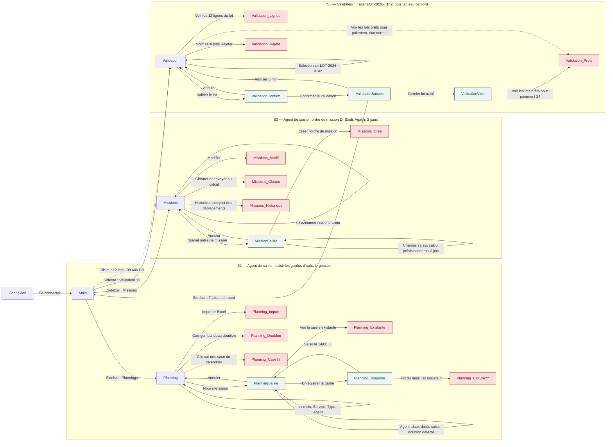

# Carte des parcours — GESTINDEM (état des maquettes au 2026-09-02)

Un nœud = un écran ou un état visible (nom du fichier de capture). Une flèche = une action, étiquetée par le libellé exact. Les nœuds rouges n'ont pas de capture : c'est un résultat d'action qui n'est pas encore dessiné.

## Lecture de la carte

| Nœud rouge | Signification | Constat |
|---|---|---|
| `Missions_Cree`, `Missions_Cloture`, `Missions_Modif` | Les trois actions de l'écran Missions n'ont pas de résultat dessiné | W-01 |
| `Validation_Lignes` | Le validateur ne peut pas voir les 12 lignes qu'il valide | W-02 |
| `Planning_Cloture??` | Rien n'indique à l'agent que le mois est terminé ni ce qui suit | W-03 |
| `Validation_Rejete` | Le résultat d'un rejet n'est pas dessiné | W-05 |
| `Validation_Prets` (flèche pointillée) | Les lots prêts pour paiement ne sont accessibles que depuis l'état vide | W-06 |
| `Planning_Case??` | On ignore si cliquer une case du calendrier ouvre la saisie | W-08 |
| `Planning_Import`, `Planning_Doublon`, `Planning_Existante`, `Missions_Historique` | Actions secondaires sans résultat dessiné | inventaire, tableau « après chaque action » |

Les nœuds verts (`PlanningSaisie`, `PlanningEnregistre`, `MissionSaisie`, `ValidationConfirm`, `ValidationSucces`, `ValidationVide`) sont les états produits par le mini-lot « saisie & états » : ils couvrent l'action principale de chaque scénario.
